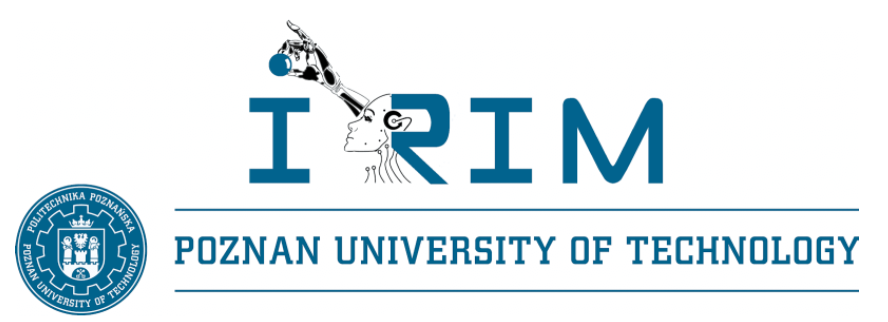
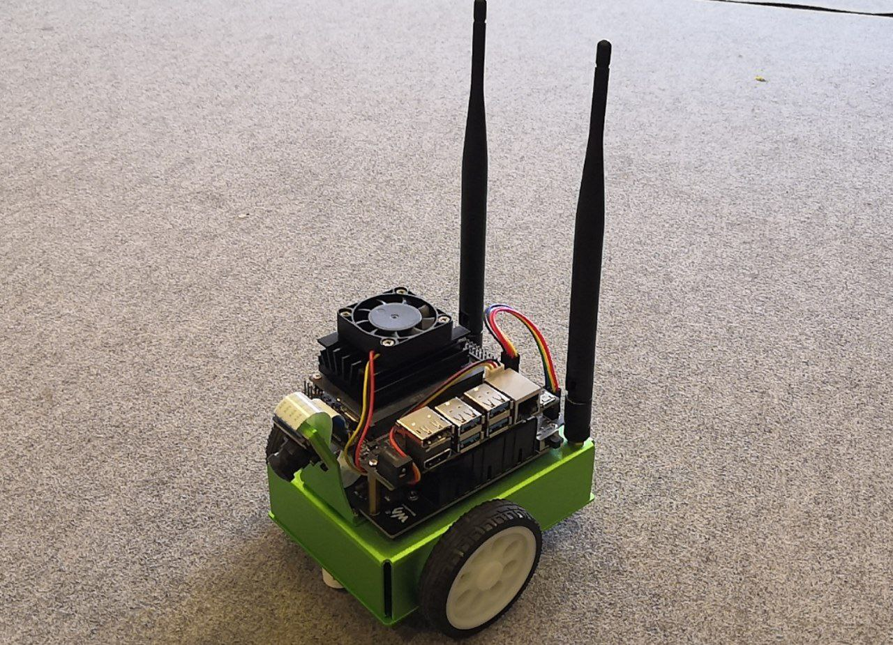
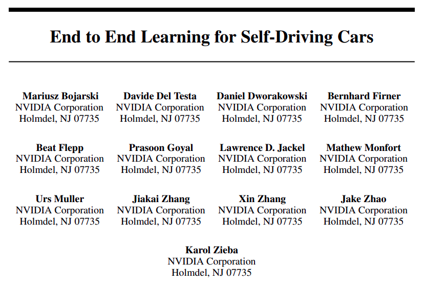
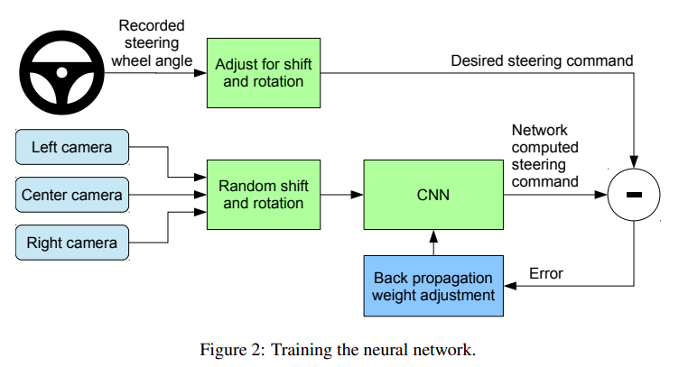
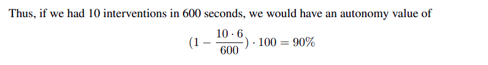
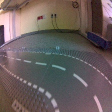
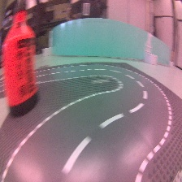

# Robotics II - the Jetbot track follower
## Poznan University of Technology, Institute of Robotics and Machine Intelligence

[Fork](https://github.com/Wojciechm-AdapptLimited/RoboticsII-Jetbot/) of the project repo of Łukasz Andryszewski and Wojciech Mączka.

The project repository is a part of the [Robotics II](https://jug.dpieczynski.pl/lab-roboticsII/) subject which is a part of the Artificial Intelligence course.

<p align="center">
  
</p>

## Introduction

<p align="center">
  
</p>

During this lab, we will try to build an autonomous system for the Waveshare Jetbot. This system will allow the vehicle to navigate the roads of LEGO city. The task will use Convolutional Neural Networks to build an end-to-end drive algorithm.

## Approach

### The short story of NVIDIA end2end driving (25 Apr 2016)

In 2016, NVIDIA proposed the curious idea of building an algorithm to control autonomous cars. The paper is called ["End to End Learning for Self-Driving Cars"](https://arxiv.org/pdf/1604.07316.pdf). This idea was one of the first attempts to use deep learning in a real-world vehicle. 

<p align="center">
  
</p>

The approach is relatively intuitive: we collect measurements from the steering wheel and accelerator pedal deflection while catching frames from the camera. We then build a regression algorithm that tries to predict signals based on the input image. This approach attempts to imitate the driver based on the camera image.

<p align="center">
  
</p>

The authors also suggested an eye-catching autonomous vehicle level metric:

<p align="center">
  
</p>

### Our clone of the approach

[](https://www.youtube.com/watch?v=oGQLA6oU2p4)

Like the authors of the publication, we decided to test this approach on a smaller scale. We used a JetBot vehicle to collect a dataset consisting of 224x224x3 resolution images and two continuous signals for two driving directions containing values between <-1,1>.

<p align="center">
  
</p>

## Dataset

The dataset collected by the course authors is [publicly available, and you can find it here](https://chmura.put.poznan.pl/s/LxYSsota5PCbXcU). You can use it or assemble your own using a gamepad!

The dataset consists of .csv files containing image name, forward signal, and left signal. The beginning and end of records have been removed to avoid teaching the vehicle zero values. 

Here are some examples from the dataset:

|    **Kind**     | **Input image**   | **Forward signal**  | **Left signal**   |
|:-------------:  |:---------------:  |:------------------: |:---------------:  |
| Forward drive   |  | 0.9921875 | 0.0 |
|   Left curve    |  | 0.453125 | 0.6328125 |
|  Right curve    |   | 0.85 | -1.0  |

## Scripts


* `config.yml` - A configuration file containing key, and fixed values.
  
  Constants are responsible for maximum speed and steering force. You can change these values, but be careful - JetBot can be really fast! The following values are the default in the course, and the provided dataset was collected on them.
  ```yaml
  robot:
    max_speed: 0.22
    max_steering: 0.5
  ```
  JetBot wheels have no encoders and are controlled independently. For this reason, we have no feedback loop. We have to "calibrate" the wheels using their power alignment.
  ```yaml
    differential:
        left: 0.0
        right: 0.0
  ```
  For each vehicle, we calculated these values empirically:

    | **Vehicle**   | **robot.differential.left**   | **robot.differential.right**  |
    |:-----------:  |:---------------------------:  |:----------------------------: |
    |  Jetbot 01    |             1.0               |              0.90             |
    |  Jetbot 02    |             0.85              |              1.00             |
    |  Jetbot 03    |             1.00              |              1.00             |
    |  Jetbot 04    |             1.00              |              1.00             |
    
  When your deep learning model is ready on board of JetBot, specify the **absolute** path to it.
   ```yaml
  model:
    path: ''
  ```

* `PUTDriver.py` - An object class that allows higher-level control of two JetBot wheels. 
* `user_driving.py` - A script to control JetBot using a gamepad. By adding the "--record" flag you record the dataset to the "./dataset/{timestamp}/" directory. **Note: For an unknown reason, the sticks send out maximum values in both axes after start-up. For this reason, move the sticks to avoid rapid acceleration.**
* `keyboard_driving.py` - A script to control JetBot using a keyboard.
* `bot_driving.py` - A script to allow movement automatically based on the results of neural network inference.

## Task
The project is designed for 3 classes. The evaluation should be done in the last class - it is allowed to do it in 2 classes if the student prepares models at home.

**Your tasks are:**
* connect your device to `VISION_student` network (`password: vision_student`),
  * WIFI adapters are required when using PCs
* start Jetbot, check its IP address, and connect via `ssh` (user: `jetbot`, password: `jetbot`)
* move to the `~/Student` directory; using the `git` terminal client, clone this repository with a unique directory name (optionally create a fork and use it)
* set the config parameters according to your JetBot number
* run the `keyboard_driving.py` script and check the vehicle behavior
  * you should use `python3` 
* (optionally) see [other examples](https://github.com/NVIDIA-AI-IOT/jetbot/tree/master/notebooks) of programmes
* download the dataset and familiarise yourself with its structure
  * (optionally) collect your own data set to expand/replace downloaded
    * ask tutor for gampad and run the `user_driving.py` script
* build a whole training pipeline and model in any framework
  * the resolution of the input image shall be equal to or less than 224x224
  * the output of the model should be 2 continuous values between <-1,1>
  * tips:
    * the model should not be too large due to computational limitations (in our case it was about 600k parameters)
    * dataset is small, for this reason, augmentations should be used, especially those affecting light changes
    * how about doing some data shift and predicting 1/2 of the control values ahead to deal with latency?
    * **Due to limited time during the classes, we recommend preparing several models and testing them all, and choosing the best one!**
* export your model to the universal onnx format (**IMPORTANT** define OPSET 11)
* modify preprocess and postprocesses functions:
  * preprocessing should be based on your pipeline
    * note that the image channels order in the script is BGR
    * note that input in onnx is always channel-first (ex. (1, 3, 224, 224))
  * postprocessing should:
    * return only 2 values clipped to the range <-1,1>
* fine-tune the JetBot controller's hyperparameters
* prepare for evaluation

## Evaluation

During the evaluation you should:
* place the code of your pipeline and model architecture on the eKursy platform (30%)
* (orally) describe the algorithm you used, how you processed the data, and any changes to the default parameters (10%)
* driving demo:
  * launch a demo of a driving vehicle that follows the road (10%)
  * complete half of the lap without accident (20%)
  * complete one lap without accident (20%)
  * complete two laps without accident (10%)


## Changelog
* May 30, 2023 - Add keyboard driving
* May 29, 2023 - Fix camera issues, define ONNX OPSET requirement, add JETBOT 04 params 
* May 30, 2022 - Add the link to the dataset
* May 29, 2022 - Add README instructions
* May 23, 2022 - Make the repository public
